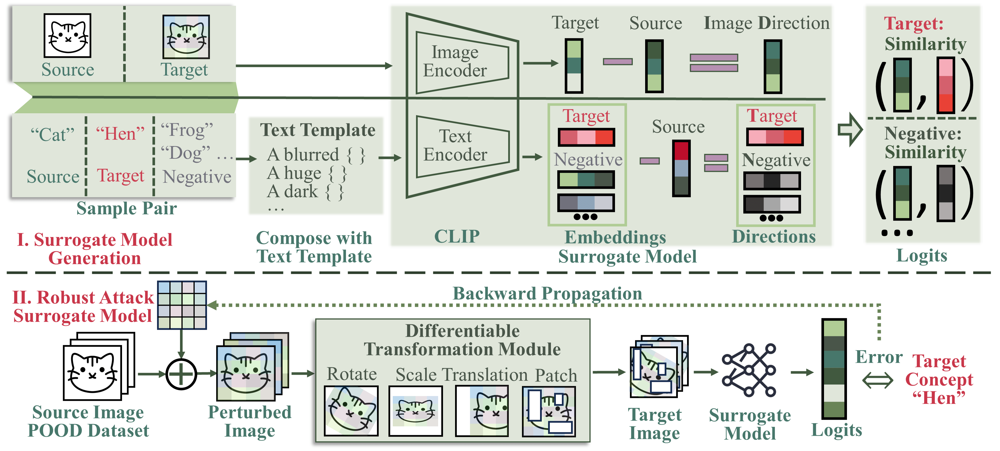
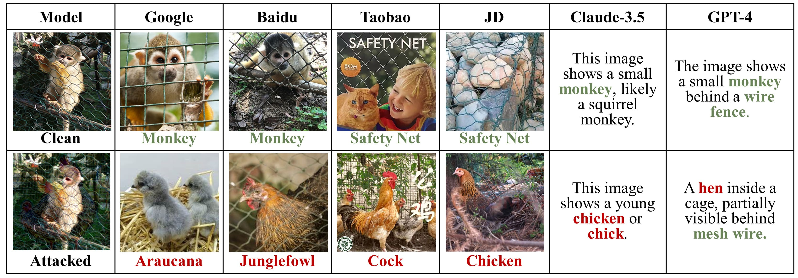

# UnivIntruder: One Surrogate to Fool Them All  
## Universal, Transferable, and Targeted Adversarial Attacks with CLIP

Deep Neural Networks (DNNs) underpin many high-stakes systems yet remain vulnerable to *unseen* adversarial and backdoor threats.  **UnivIntruder** shows how **one** publicly-available vision-language model (CLIP) can be harnessed to create *universal*, *transferable* and *targeted* perturbations that hijack completely black-box models—no architecture, weights or data access required.

<div align="center">
  
</div>

---

## ✨ Key Features

* **Universal Transferability** – a single trigger fools *dozens* of unseen classifiers (ConvNets, ViTs, MLP-Mixers…).
* **Task Hijacking by Text** – specify the malicious class with a *text prompt*; UnivIntruder aligns CLIP’s embedding space with the victim’s.
* **Data-free & Query-free** – relies only on *public* OOD images; zero queries to the protected model.
* **High Attack Success Rate** – up to **99.4 % ASR** on CIFAR-10 and **85 % ASR** on ImageNet.
* **Real-world impact** – compromises Google/Baidu Image Search and V-LLMs such as GPT-4 and Claude-3.5.

---

## 📂 Project Layout

| Path | Purpose |
|------|---------|
| `dataset/` | Dataset loaders (CIFAR-10/100, Tiny-ImageNet, Caltech-101, ImageNet). |
| `experiments/` | Command recipes, logs & configs used in the paper. |
| `robustness_evaluation/` | Scripts for Tables 8-9 (RobustBench + external defences). |
| `samples/` | Pre-trained universal triggers. |
| `utils/` | Helper functions (augmentation, logging, metrics…). |

---

## ⚙️ Environment

* **OS** Ubuntu 22.04  
* **Python** 3.10  **PyTorch** ≥ 2.1  
* **NVIDIA** GPU with ≥ 8 GB VRAM (for ImageNet runs)

```bash
conda create -n univintruder python=3.10 -y
conda activate univintruder
pip install -r requirements.txt          # includes robustbench
````

---

## 🚀 Usage

### 1  Training a Universal Perturbation

replace `/data/datasets` with your custom dataset path

```bash
python main.py \
  --tgt_dataset CIFAR10 \
  --data_path /data/datasets \
  --target 8 \
  --eps 32 \
  --pood TinyImageNet \
  --batch_size 256 \
  --max_step 5000 \
  --image_size 32
```

### 2  Standard Evaluation

```bash
python evaluate.py \
  --tgt_dataset CIFAR10 \
  --data_path /data/datasets \
  --ckpt samples/triggers/cifar10_32_255.pth \
  --target 8 \
  --eps 32 \
  --image_size 32
```

### 3  Per-image Protector Branch

```bash
# Dataset mode: optimize one delta per target-dataset image
python main_per_image.py \
  --mode dataset \
  --tgt_dataset CIFAR10 \
  --data_path /data/datasets \
  --target 8 \
  --split test \
  --max_images 16 \
  --eps 32 \
  --image_size 32 \
  --steps 500 \
  --output_dir experiments/per_image_cifar10
```

```bash
# Minimal evaluation on saved protected images with the clean target model
python evaluate_per_image.py \
  --samples_path experiments/per_image_cifar10 \
  --tgt_dataset CIFAR10 \
  --target 8 \
  --data_path /data/datasets
```


#### Stage A Calibration Helpers

```bash
# Re-run evaluation with proxy + grouped metrics + lightweight image-quality metrics
python evaluate_per_image.py   --samples_path experiments/per_image_IM/dataset_ImageNet_eps_64_img_224_target_8_aug_0.25_tv_0.01_par_64_xxxxxxxx   --tgt_dataset ImageNet   --target 8   --data_path /data/datasets
```

```bash
# Compare the two current candidates and generate a Stage A report
python stage_a_report.py   --candidate_a experiments/per_image_IM/dataset_ImageNet_eps_64_img_224_target_8_aug_0.25_tv_0.01_par_64_xxxxxxxx   --candidate_b experiments/per_image_IM/dataset_ImageNet_eps_64_img_224_target_8_aug_0.25_tv_0.05_par_64_xxxxxxxx
```

The Stage A report saves:
- aggregate proxy metrics
- source-group comparison tables
- PSNR / SSIM / L2 / Linf quality metrics
- a qualitative comparison wall
- an artifact review template for manual visual inspection

#### Stage B Pilot Skeleton

```bash
# Prepare a lightweight i2v pilot protocol workspace
python prepare_i2v_pilot.py   --primary_candidate_dir experiments/per_image_IM/dataset_ImageNet_eps_64_img_224_target_8_aug_0.25_tv_0.01_par_64_xxxxxxxx   --secondary_candidate_dir experiments/per_image_IM/dataset_ImageNet_eps_64_img_224_target_8_aug_0.25_tv_0.05_par_64_xxxxxxxx   --output_dir experiments/i2v_pilot/example_pilot   --model_ids local_model_a   --prompt "a calm cinematic scene"
```

```bash
# After manual annotation, summarize whether the pilot shows meaningful signal
python summarize_i2v_pilot.py   --pilot_dir experiments/i2v_pilot/example_pilot
```

The Stage B helpers intentionally stop at protocol / annotation / summary management. They do not force a specific i2v generation backend.

### 4  Quick Start with Pretrained Models

```python
import torch
trigger = torch.load('samples/triggers/cifar10_32_255.pth')
adv_img = (img + trigger).clamp(-1, 1)   # img ∈ [-1, 1]
```

<div align="center">
  
</div>

---

## 🔁 Reproducing Paper Results

### ✅ Checkpoint Groups and Corresponding Scripts

| Checkpoint Filename(s) | Experiment Purpose | Paper Table/Figure | Python Script(s) |
|------------------------|--------------------|--------------------|------------------|
| `cifar10_32_255_target_1.pth`<br>`cifar10_32_255_target_3.pth`<br>`cifar10_32_255_target_5.pth`<br>`cifar10_32_255_target_7.pth`<br>`cifar10_32_255_target_9.pth` | Evaluation with varying target classes | Table 2 | `evaluate.py` |
| `cifar10_8_255.pth`<br>`cifar10_16_255.pth`<br>`cifar10_24_255.pth`<br>`cifar10_32_255.pth` | Varying perturbation budgets on CIFAR-10 | Figure 4, 5 | `evaluate.py` |
| `imagenet_32_255.pth`<br>`cifar10_32_255.pth`<br>`cifar100_32_255.pth`<br>`caltech101_32_255.pth` | Cross-model universal transferability | Figure 3 | `evaluate.py` |
| `imagenet_32_255.pth`<br>`imagenet_32_255_siglip.pth`<br>`imagenet_32_255_imagebind.pth` | Comparison across different VLP surrogates (CLIP, SigLIP, ImageBind) | Table 7 | `evaluate.py`<br>`main_siglip.py`<br>`main_image_bind.py` |
| `imagenet_16_255.pth`<br>`imagenet_32_255.pth`<br>`cifar100_24_255.pth`<br>`cifar100_32_255.pth` | Varying ε on ImageNet and CIFAR-100 | Figure 4 | `evaluate.py` |
| `cifar10_32_255.pth`<br>`cifar100_32_255.pth`<br>`imagenet_32_255.pth` | Robust model evaluation (RobustBench) | Table 8 | `evaluate_robustness_c10.py`<br>`evaluate_robustness_c100.py`<br>`evaluate_robustness_imagenet.py` |

### Table 3 – Cross-model Transferability

```bash
python evaluate.py \
  --tgt_dataset ImageNet \
  --data_path /data/datasets \
  --ckpt samples/triggers/imagenet_32_255.pth \
  --target 8 --eps 32 --image_size 224
```

Replace `ImageNet` by `CIFAR10`, `CIFAR100` or `Caltech101` and use the matching checkpoint in `samples/triggers/` to reproduce other rows.

### Table 2 – Varying Target Class

```bash
for T in 1 3 5 7 9; do
  python evaluate.py \
    --tgt_dataset CIFAR10 \
    --data_path /data/datasets \
    --ckpt samples/triggers/cifar10_32_255_target_${T}.pth \
    --target $T --eps 32 --image_size 32;
done
```

### Figure 4 – Varying Perturbation Budget

```bash
for E in 8 16 24 32; do
  python evaluate.py \
    --tgt_dataset CIFAR10 \
    --data_path /data/datasets \
    --ckpt samples/triggers/cifar10_${E}_255.pth \
    --target 8 --eps $E --image_size 32;
done
```

### Table 7 – Different VLP Surrogates

```bash
# Train with SigLIP
python main_siglip.py \
  --tgt_dataset CIFAR10 --data_path /data/datasets \
  --target 8 --eps 32 --pood TinyImageNet \
  --batch_size 256 --max_step 5000 --image_size 32
```

```bash
# Evaluate ImageBind-based trigger on ImageNet
python evaluate.py \
  --tgt_dataset ImageNet --data_path /data/datasets \
  --ckpt samples/triggers/imagenet_32_255_imagebind.pth \
  --target 8 --eps 32 --image_size 224
```

### Tables 8 – Robust Defences

```bash
python evaluate_robustness_c10.py \
  --data_path /data/datasets \
  --ckpt samples/triggers/cifar10_32_255.pth \
  --target 8 --eps 32 --image_size 32
```

Make sure you install RobustBench before continuing. Use `evaluate_robustness_c100.py` or `evaluate_robustness_imagenet.py` together with the matching checkpoint in `samples/triggers/` to reproduce results in other datasets.

---

## 📜 Citation

```bibtex
@inproceedings{10.1145/3719027.3744859,
  author = {Xu, Binyan and Dai, Xilin and Tang, Di and Zhang, Kehuan},
  title = {One Surrogate to Fool Them All: Universal, Transferable, and Targeted Adversarial Attacks with CLIP},
  year = {2025},
  isbn = {9798400715259},
  publisher = {Association for Computing Machinery},
  address = {New York, NY, USA},
  url = {https://doi.org/10.1145/3719027.3744859},
  doi = {10.1145/3719027.3744859},
  booktitle = {Proceedings of the 2025 ACM SIGSAC Conference on Computer and Communications Security},
  pages = {3087–3101},
  numpages = {15},
  keywords = {transferable adversarial attacks, universal adversarial attacks},
  location = {Taipei, Taiwan},
  series = {CCS '25}
}

```

---

© 2025 UnivIntruder Authors — MIT License
# Univ_I2V
